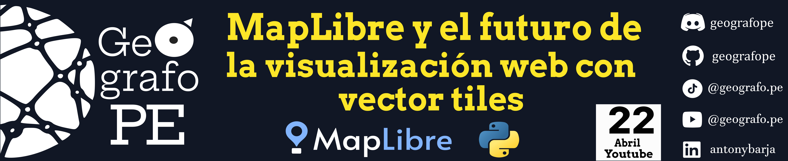

Este repositorio 🗂️ contiene un notebook📜 desarrollado en  que te facilitirá la creación de visualizaciones web de datos espaciales através de la integración de los vector tiles disponibles en MapLibre junto con el ecosistema espacial de python.

MapLibre es un proyecto de código abierto que se **nacio un 9 de diciembre del 2020 como un fork del proyecto Mapbox GL JS 1.13**.

 
 

📝📃🛑: [Clic para ver el memorandum](https://docs.google.com/document/d/1UB8VJ6_vMD9Zxfem7cunwa_G-hXo_ZRY1IeF5iGlh4w/view
)

### 🟡 Requerimientos: 
Para este video usaremos las siguientes librerias: 👇

- **maplibre**: Librería que permite la integración del API de MapLibre con Python.

- geopandas: Librería que permite trabajar datos espaciales de tipo vector en python.

Todo el proceso desarrollado esta explicado paso a paso en el siguiente video de Youtube 🔴🎞️🎥🎬. Watch the video

¡Enteráte más y aprender conmigo! 🔍💡 Suscríbete, activa las notificaciones 🔔 y únete a la comunidad que ama el software libre de codigo abierto. 🌟🌍👇

<!---

--->

-  https://www.youtube.com/@geografope

-  https://www.tiktok.com/@geografope

### 🟡 Referencias:
- *MapLibre, (2021),MapLibre GL JS, GitHub. https://github.com/maplibre/maplibre-gl-js/*

- *Netek R, Masopust J, Pavlicek F, Pechanec V. Performance Testing on Vector vs. Raster Map Tiles—Comparative Study on Load Metrics. ISPRS International Journal of Geo-Information. 2020; 9(2):101. https://doi.org/10.3390/ijgi9020101*

- *Chen L, Liu Z, Ma M. Interactive Visualization of Geographic Vector Big Data Based on Viewport Generalization Model. Applied Sciences. 2022; 12(15):7710. https://doi.org/10.3390/app12157710*

- *eoda GmbH, 2023,py-maplibregl, https://github.com/eodaGmbH/py-maplibregl*

- *Mapbox. (s.f.). Introducción a los vectores de teselas. Mapbox. Recuperado de https://docs.mapbox.com/data/tilesets/guides/vector-tiles-introduction/*
